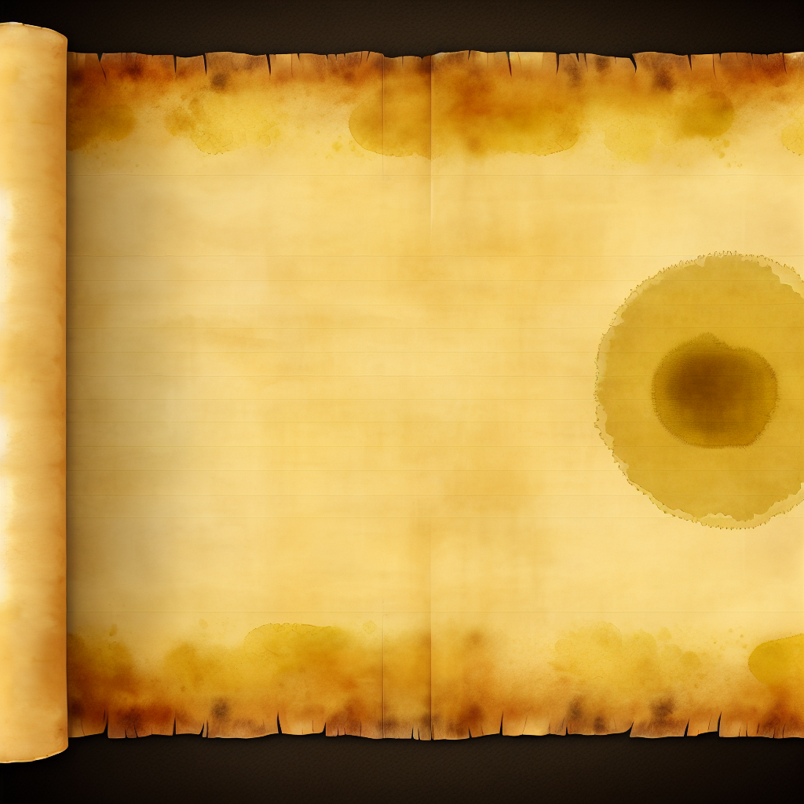
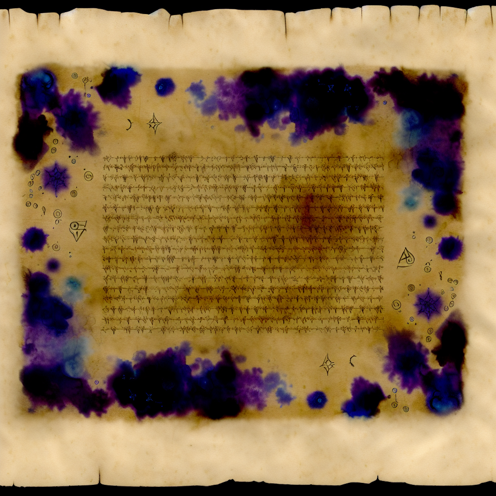

% The Necromancer: Player's Guide
% Beta v1.1
% February 14, 2026

# A Word Before You Descend

There are games in which death is delay.
This is not one of them.

In these halls beneath Dol Guldur, each turn is a wager between knowledge and fear. You are not here to clear every chamber, nor to build an invincible hero. You are here to do one hard thing well: descend, recover Thrain's map and key, and return alive.

This guide is written in the spirit of old roguelike manuals: plain where it must be plain, and exact where precision keeps you alive.

\newpage

# Contents

1. About The Necromancer
2. What Kind of Game This Is
3. The Beta v1.1 Objective
4. Core Run Loop
5. Controls and Interface
6. Character Creation and Build Identity
7. The Four Stats
8. Skills, XP, and Ability Timing
9. Combat Doctrine
10. Stealth, Pursuit, and Disengagement
11. Light Economy
12. Voice and Lore Economy
13. Inventory, Gear, and Utility Slots
14. Floor Progression and Risk Management
15. Threat Reading and Death Forensics
16. Build Paths for Early Wins
17. Notes for Sil-Q Players
18. Practical Win Checklist
19. Appendix: Hotkeys

\newpage

# 1. About The Necromancer

The Necromancer belongs to a long open-source line.

- `Rogue` established the grammar: procedural descent, scarce resources, and irreversible death.
- `Moria`, then `Angband`, deepened simulation, item identity, and tactical variance.
- `Sil` and `Sil-Q` sharpened that lineage into something harder and cleaner: positional combat, high consequence, and Tolkien fidelity treated as design law rather than ornament.

The Necromancer continues that tradition in the Third Age.

The first implementation path for this project began in C with Sil-Q's structure as its mechanical compass. The project was then fully ported into Godot to make the game more legible, more teachable, and easier for a modern audience to approach without sacrificing the core roguelike compact:

- permadeath means decisions matter,
- the identification and interpretation game still matters,
- the delve-recover-escape arc remains the spine,
- Tolkien's world is treated as source material, not set dressing.

Sil-Q is not replaced here. It is honored. The Necromancer is a sibling work with different era, different pressures, and the same demand for disciplined play.

# 2. What Kind of Game This Is

The Necromancer is a turn-based, tile-based, permadeath roguelike.

You are expected to:
- evaluate danger before committing,
- preserve optionality,
- avoid unnecessary fights,
- convert information into tempo.

The game punishes greed faster than caution. It also punishes passivity: refusing to spend resources until too late is one of the most common causes of death.

# 3. The Beta v1.1 Objective

In Beta v1.1, the victory route is intentionally focused.

To win:
1. Descend and secure **Thrain's map and key**.
2. Return to depth 1.
3. Take the upstairs.

If requirements are satisfied, the current beta ending appears:

"Congratulations, you escaped! Now to meet Gandalf..."

This is the beta completion state. A larger post-escape exterior chapter is planned later.

# 4. Core Run Loop

Each successful run follows the same broad rhythm:

1. **Stabilize**
Acquire a reliable weapon line, survivable positioning options, and working light.

2. **Specialize**
Spend XP on tools that solve present danger, not imagined future elegance.

3. **Pressure test**
As depth rises, enemy composition and room geometry reduce your margin for error.

4. **Recover objective**
Take calculated risks when objective proximity justifies them.

5. **Ascend under stress**
Return pathing is often deadlier than descent because mistakes compound.

# 5. Controls and Interface

The interface is built around quick reads:
- combat/log feedback,
- depth and threat state,
- hotbar and utility access,
- resource pools (HP, voice, related combat economies).

If you feel input friction, first close overlays with `Esc`, then retry. Most "stuck" states are panel focus collisions rather than hard lock.

## Startup scale and framing

Beta v1.1 targets clean default framing on common desktop displays (notably 1920x1080 behavior). If your frame is clipped, report exact resolution and OS scaling in bug notes.

# 6. Character Creation and Build Identity

Race, house, and trait are strategic commitments.

Practical rule for early consistency:
- pick one primary lane and fund it immediately.

Common collapse pattern:
- buying "a little of everything" early and reaching depth 4-6 with no decisive answer to burst damage or crowd pressure.

# 7. The Four Stats

## Strength
Improves force-based solutions, heavy gear handling, and direct combat authority.

## Dexterity
Improves precision, reactive defense lines, and positional flexibility.

## Constitution
Expands survival tolerance and forgiveness against imperfect reads.

## Grace
Shapes voice/lore capability and supports control-heavy game plans.

Beginner-safe guidance:
- do not tank Constitution to chase elegant offense. Most first wins are disciplined survivability wins.

# 8. Skills, XP, and Ability Timing

XP is your most adaptable resource after information.

Good spending asks:
1. What is killing me right now?
2. Which purchase changes that outcome immediately?
3. What path am I delaying to buy this?

## Minor actions and turn economy (Beta v1.1)

A key beta correction: many non-attack, non-movement hotbar abilities are treated as minor actions. Setup play should not be a disguised self-stun.

If your build depends on parry/mark/circular guard style setup, confirm your tactics rely on this tempo rule rather than sacrificing full turns in lethal windows.

# 9. Combat Doctrine

Combat in The Necromancer is not solved by damage alone.

Use this order of operations:
1. **Geometry first**: fight in chokepoints, never in open multi-angle kill boxes when avoidable.
2. **Initiative second**: choose when contact begins.
3. **Resource third**: spend what keeps tomorrow available.

When unsure, retreat one turn earlier than instinct suggests.

# 10. Stealth, Pursuit, and Disengagement

Stealth is a primary win language, not a side feature.

Use it to:
- decide engagement order,
- cut down chain pulls,
- avoid low-value attrition.

If detected in poor terrain:
- break line,
- reset spacing,
- re-engage on your terms.

"Can I win this fight?" is often the wrong question.
The right one is: "Can I win this exchange without ruining the next three?"

# 11. Light Economy

Light controls knowledge radius; knowledge radius controls survival.

## Beta v1.1 anchor values
- Torch: +2
- Lantern: +3
- Elvish Light: +2, infinite, no charge drain
- Mallorn Torch: +3
- Jeweled (Feanorian) Lamp: +4, infinite, no charge drain
- Light of the Eldar aura: +2

Design truth:
- Necromancer is intentionally oppressive, but deep darkness should be tense, not blind and arbitrary.

Practical rule:
- never enter a new risk band without a clear next light plan.

# 12. Voice and Lore Economy

Voice is not decoration. It is decisive power with real opportunity cost.

Beta v1.1 direction:
- reduce sustain loops that trivialize scarcity,
- preserve high-impact word identity,
- keep pure-lore victories difficult but viable.

If you repeatedly die with full voice, you are under-spending a principal survival currency.

If you repeatedly arrive at critical fights dry, you are over-spending on low-leverage moments.

# 13. Inventory, Gear, and Utility Slots

Utility systems should reduce friction, not create it.

Core practice:
- stage activatable tools where they can be used under pressure,
- verify context-legal activation before danger spikes,
- audit your kit at each floor transition.

Beta expectation:
- interactive consumables and devices should be accessible from proper hotbar/utility paths when configured.

# 14. Floor Progression and Risk Management

Depth progression is not linear power fantasy. It is compression.

You have less room for recovery as:
- map states become less forgiving,
- pursuit pressure rises,
- resource replacement intervals widen.

Use floor transitions as planning checkpoints:
1. Is my light plan stable?
2. Can I survive two bad engagements in a row?
3. Do I have one emergency answer still unspent?

# 15. Threat Reading and Death Forensics

Most deaths are prepared long before the final blow.

Post-run review protocol:
1. Identify first preventable error (not the final hit).
2. Classify failure: positioning, timing, greed, or resource denial.
3. Define one concrete behavior change for next run.

Do not call it bad luck until you can prove no better line existed.

# 16. Build Paths for Early Wins

## A. Durable frontliner
- Prioritize survivability and stable melee exchanges.
- Convert ambiguous rooms into controlled lane fights.

## B. Ranged control
- Build around spacing, scouting, and tempo denial.
- Never permit uncontrolled melee collapse.

## C. Lore-led tactician
- Build Grace/voice pathways with disciplined sustain budgeting.
- Treat lore activations as encounter-shaping commitments.

All three can win. The difference is where your mistakes become fatal.

# 17. Notes for Sil-Q Players

What carries over:
- positional rigor,
- information as a weapon,
- tactical patience,
- severe consequences for poor sequencing.

What does not carry over directly:
- exact value parity,
- exact action economy assumptions,
- identical interface cadence.

The right adaptation posture is principle transfer, not number memorization.

# 18. Practical Win Checklist

Before objective push:
- I can survive two hard encounters without perfect rolls.
- My light plan covers descent and retreat.
- My voice plan includes one panic option.
- My utility bar contains tools I can actually trigger under stress.

Before ascent attempt:
- Thrain's map and key are secured.
- I have a route and fallback route.
- I am not relying on one fragile assumption.

# 19. Appendix: Hotkeys

Movement:
- `W/A/S/D`, arrows, or vi keys `H/J/K/L`
- diagonals `Y/U/B/N`
- wait `.`

Core actions:
- interact/confirm/stairs `Enter`
- pick up `G`
- inventory `I`
- tome `T` or `@`
- voice/lore `V`
- look `X`
- minimap `M`
- stealth toggle `;`
- pause/settings `Esc`

Hotbar:
- gem slots `1-8` (cast/bind depending on slot state)

\newpage

# 20. Skills and Abilities Compendium

This section is generated from `data/ability.txt` so the guide tracks the real beta ruleset.

Reading keys:
- `Level`: minimum effective skill value for unlock.
- `Type`: Active means you trigger it; Sustain means ongoing voice commitment; Passive is always-on when learned.
- `Prereq`: listed as `skill/ability` internal references where relevant.

## Melee

Frontline control, kill conversion, and positional dominance.

| Level | Ability | Type | Prereq | What It Does (Practical) |
|---|---|---|---|---|
| 1 | Power | Passive | - | Gives a bonus of +1 damage sides to your melee attacks, but makes it harder to score critical hits (increasing the base required by 1). |
| 2 | Finesse | Passive | - | Lowers the base number needed to get critical hits with melee from 7 to 5. |
| 3 | Knock Back | Passive | - | You have a chance to knock enemies back a square in melee depending upon your effective strength and your opponent's constitution. |
| 4 | Polearm Mastery | Passive | - | Gives you +2 to attack with polearms (spears & glaives) and lets you set them to receive free attacks on advancing enemies when you wait (z or 5). |
| 5 | Charge | Passive | - | When you attack an opponent immediately after moving towards it, your attack is calculated as if you had 3 points more strength and dexterity. |
| 6 | Follow-Through | Passive | 0/0:0/1 | Allows you to continue your attack if you kill an opponent, moving onto the next adjacent enemy. |
| 7 | Opening Strike | Passive | 0/1 | Grants an additional damage die on your first melee attack against an unwary or sleeping enemy. Your Ranger training pays off. |
| 8 | Subtlety | Passive | 0/1 | Lowers the base number needed to get critical hits with melee by 2 points, when you are using a one handed weapon with the other hand free. |
| 9 | Cleave | Passive | 0/3:0/5 | When you kill an enemy, you get free attacks on all other adjacent enemies. Your blade sweeps through the horde. |
| 10 | Zone of Control | Passive | 0/1:0/3 | You get a free attack whenever an opponent moves between two squares which are adjacent to you. |
| 11 | Mighty Blow | Passive | 0/2:0/4 | When using a two-handed weapon, your first attack each turn deals bonus damage equal to your Strength. If you use this, you lose a turn to recover from the exertion. |
| 12 | Defensive Stance | Passive | 0/1:2/1 | When you do not move, you gain +3 evasion and enemies do not gain flanking bonuses against you. Hold the line like Gondor's defenders. |
| 13 | Swift Strikes | Passive | 0/7:3/4 | When wielding a one-handed weapon, you gain an extra attack but your attacks are calculated as if you had 3 less Strength and Dexterity. |
| 20 | Strength | Passive | - | You gain a point of strength. |

## Archery

Range control and opening damage before melee contact.

| Level | Ability | Type | Prereq | What It Does (Practical) |
|---|---|---|---|---|
| 2 | Rout | Passive | - | Firing at fleeing monsters is calculated as if you had 5 points more dexterity. |
| 3 | Fletchery | Passive | - | Allows you to use the '-' command to give ordinary arrows a +3 bonus. Takes one turn for each arrow. |
| 4 | Point Blank Archery | Passive | - | The monster you are firing at cannot get an attack of opportunity. |
| 5 | Puncture | Passive | - | Whenever an enemy's armour roll would fully block your archery damage roll, you deal the enemy a flat five damage instead. |
| 6 | Ambush | Passive | - | Grants an additional critical damage die whenever you hit an unwary or sleeping monster with an arrow. |
| 7 | Keen Eyes | Passive | - | You gain +2 to archery attacks at ranges beyond 5 squares, and can spot enemies in dim light at the edge of your vision. Elven far-sight. |
| 8 | Crippling Shot | Passive | 1/3:1/4 | Your critical hits sometimes temporarily slow monsters (depending on the level of critical and the monster's Will). |
| 9 | Deadly Hail | Passive | 1/0:1/3 | Arrows fired the turn after killing an enemy with an arrow do twice their normal damage. |
| 10 | Dexterity | Passive | - | You gain a point of dexterity. |

## Evasion

Survivability through movement discipline, shields, and reaction tools.

| Level | Ability | Type | Prereq | What It Does (Practical) |
|---|---|---|---|---|
| 2 | Dodging | Passive | - | Gives you a +3 bonus to evasion if you moved on your last turn. |
| 3 | Blocking | Passive | - | Doubles the protection roll for your shield against all attacks if you did not move on your last turn. |
| 4 | Parry | Passive | - | Doubles the evasion bonus granted by your primary melee weapon. |
| 5 | Circular Guard | Passive | - | Halves the bonus opponents get for surrounding you. |
| 6 | Leaping | Passive | - | You can leap over a chasm or trap if you moved towards it the previous turn. (Roosts and webs are not leapable). |
| 7 | Sprinting | Passive | 2/0:2/4 | You start moving more quickly if you run four or more squares in roughly the same direction. |
| 8 | Flanking | Passive | - | Gives you a free attack on an opponent if you step from a square which is adjacent to it, to another square which is adjacent to it. |
| 9 | Heavy Armour Use | Passive | 2/1:2/3 | Gives you [1dX] protection, where X is your total armour weight divided by 15 lbs. |
| 10 | Riposte | Passive | 2/2 | It gives you a free attack on an opponent who misses you by at least 10 + the weight of your weapon (only once per round). |
| 11 | Controlled Retreat | Passive | 2/0:2/1 | Gives you a free attack on an opponent when you step away from it, but only if you did not move the previous round. |
| 20 | Dexterity | Passive | - | You gain a point of dexterity. |

## Stealth

Detection denial, opener quality, and disengagement flexibility.

| Level | Ability | Type | Prereq | What It Does (Practical) |
|---|---|---|---|---|
| 3 | Disguise | Passive | - | Halves any bonuses that awake but unwary enemies have to notice you due to you being in their line of sight. |
| 4 | Assassination | Passive | - | Gives you a melee bonus against non-alert creatures equal to your stealth score. |
| 4 | Throat Slit | Passive | 3/1 | You can instantly kill sleeping or unaware humanoid enemies without alerting nearby monsters. A quick, silent death in the darkness. |
| 5 | Disorienting Strike | Passive | 3/1 | Your critical hits sometimes confuse monsters with the pain (depending on crit level vs Will). Confused enemies lose track of you. |
| 6 | Escape Artist | Passive | 3/0:2/3 | You can break free from webs and similar effects automatically. Traps deal half damage and don't alert nearby enemies. |
| 6 | Distraction | Passive | 3/0 | When an alert enemy misses you by 5 or more, they become confused for 1 turn. Quick footwork leaves your foes bewildered. |
| 7 | Light Fingers | Passive | 3/1 | When adjacent to an unwary enemy, you can attempt to steal a random item without alerting them. Like a proper burglar. |
| 8 | Vanish | Passive | 3/0 | Gives a +10 stealth bonus towards making enemies become unwary when you are out of their line of sight. |
| 9 | Fade | Passive | 3/1:3/5 | When you kill an unaware enemy, you fade into the shadows and become invisible to other enemies for 2 turns. Chain assassinations. |
| 10 | Pilfer | Passive | 3/4 | Your kills have a 25% chance to drop an extra item. A thief's eye for hidden treasures ensures you always profit from your work. |
| 11 | Dexterity | Passive | 3/0:3/1 | You gain a point of dexterity. |
| 12 | Silent Kill | Passive | 3/7:3/8 | Removes the humanoid restriction from Throat Slit. Any sleeping or unaware enemy can be silently dispatched. The ultimate assassin. |

## Hunting

Target control, information quality, and objective pressure.

| Level | Ability | Type | Prereq | What It Does (Practical) |
|---|---|---|---|---|
| 1 | Natural Talent | Passive | - | You possess an innate gift that allows you to take advanced abilities without the usual prerequisites. Some are simply born to greatness. |
| 2 | Mark Quarry | Active | - | Active. Mark a visible enemy as your quarry for several turns. Reading and pressuring the marked foe grants tactical advantage. |
| 3 | Keen Senses | Passive | - | Allows you to see enemies who are just beyond the edge of a pool of light, and gives a +5 bonus to spot 'invisible' creatures. |
| 4 | Concentration | Sustain | - | Sustained pressure on your marked quarry builds Focus. Focus improves your duel state and feeds finishing windows. |
| 5 | Alchemy | Passive | - | Lets you identify all herbs and potions. Your knowledge of natural compounds also allows you to create improved herbs: combine two identical herbs to produce a mo... |
| 6 | Expose Weakness | Active | - | Active. Read your marked quarry and open its guard. On success, temporarily reduce evasion and protection. |
| 7 | Outwit | Passive | - | Whenever you receive a critical hit, make a Hunting roll against the attacker's Perception. If you succeed, negate all critical damage. |
| 8 | Listen | Passive | 4/2 | Gives you a chance each turn to detect enemies that you cannot see (including around corners and through doors). |
| 9 | Exploit Opening | Passive | 4/3:4/5 | Active finisher. Spend accumulated Focus to arm your next strike against the marked quarry for bonus damage and crit pressure. |
| 10 | Grace | Passive | - | You gain a point of grace. |

## Will

Mental resilience, anti-curse utility, and clutch survival.

| Level | Ability | Type | Prereq | What It Does (Practical) |
|---|---|---|---|---|
| 1 | Curse Breaking | Passive | - | Allows you to break the curses on items when you attempt to take them off. |
| 2 | Force of Will | Passive | - | Your mental strength lets you recognise all staves and horns and use them twice as efficiently. |
| 3 | Strength in Adversity | Passive | - | Gives you bonuses to Strength, Dexterity and Grace when seriously injured: +1 when less than or equal to 50% health, +3 when 25%. |
| 4 | Formidable | Passive | - | Slaying enemies in melee scares all other enemies who see it. Enemies do not gain morale based on your injuries. |
| 5 | Defy Death | Passive | 5/2 | Once per floor, when reduced to 0 HP, make a Will save to survive with 1 HP. Your determination keeps you fighting beyond mortal limits. |
| 5 | Indomitable | Passive | - | Gives you resistance to fear, confusion, stunning, and hallucination. Slows hunger to one third the normal rate. |
| 6 | Oath | Passive | - | Swear a great oath, and be rewarded for keeping it. |
| 7 | Poison Resistance | Passive | - | Gives you resistance to poison. |
| 8 | Vengeance | Passive | 5/2 | When you are damaged in melee by an enemy, an additional damage die is added to your next successful strike. This effect does not stack. |
| 9 | Majesty | Passive | 5/0:5/4 | Lowers monster morale by half the difference between your Will and theirs. |
| 12 | Constitution | Passive | - | You gain a point of constitution. |

## Smithing

Long-run power through gear quality and forging economy.

| Level | Ability | Type | Prereq | What It Does (Practical) |
|---|---|---|---|---|
| 2 | Weaponsmith | Passive | - | Allows you to create weapons. |
| 3 | Armoursmith | Passive | - | Allows you to create armour. |
| 4 | Jeweller | Passive | - | Allows you to create rings, amulets, and light sources, and identify such items you encounter. The craft of adornment and illumination. |
| 5 | Reforge | Passive | - | Allows you to combine two Broken Glowing items at a forge to create a randomly enchanted item of that type. Costs 600 experience points. |
| 6 | Expertise | Passive | 6/3 | Reduces the time taken to forge an item by half and reduces experience and stat costs by 50%. At Smithing 10 or higher, reduction increases to 75%. |
| 7 | Reclaim | Passive | 6/3 | Allows you to combine two Broken Strange items at a forge to create a random artifact of that type. The artifact is drawn from the legends of Middle-earth. |
| 8 | Masterwork | Passive | 6/5 | Allows you to combine four Broken Strange items at a forge to create a legendary artifact. These are the greatest works of the Third Age, surpassing even ancient... |
| 10 | Grace | Passive | - | You gain a point of grace. |
| 12 | Reforge Mastery | Passive | 6/3 | When using Reforge, you may reject the random result once and reroll. You must accept the second result. |
| 14 | Salvage | Passive | 6/8 | When equipment would be destroyed by acid, fire, or breakage, there is a 50% chance to recover it as a Broken Glowing item instead of losing it entirely. |
| 16 | Reclaim Mastery | Passive | 6/5 | When using Reclaim, you are shown three random artifacts of the chosen type and may select which one to create. |
| 20 | Master Smith | Passive | 6/6 | Your legendary skill allows you to create Masterwork items with only 2 Broken Strange items instead of 4. |

## Song (Lore)

Voice-powered active and sustained lore tools.

| Level | Ability | Type | Prereq | What It Does (Practical) |
|---|---|---|---|---|
| 1 | Lore of Hidden Ways | Passive | - | Your knowledge of concealment dampens all nearby sounds and senses, reducing monster perception temporarily. Uses status-based drain. |
| 1 | Word of Opening | Passive | - | Speaking the words of unbinding, you discover and overcome nearby doors, traps, and rubble. Grants freedom of movement. |
| 2 | Deep Memory | Passive | - | Drawing on ancestral knowledge, you gradually perceive the layout of your surroundings, sensing passages and chambers nearby. |
| 2 | Herbcraft | Sustain | - | A sustained song of healing lore. While active, stops bleeding each turn, grants +50% rest regeneration, and doubles herb effectiveness. Drains 1 voice charge per... |
| 3 | Lore of Naming | Passive | - | Your knowledge of the true names of creatures grants +2 to Will contests against types you have previously slain. Also reveals monster stats when you examine them. |
| 3 | Light of the Eldar | Passive | - | Your spirit shines with inner radiance, increasing your light radius by 1 per 3 Lore. Shadow creatures suffer -2 attack and -2 evasion in your light. Wraiths take... |
| 3 | Song of the Trees | Sustain | - | A sustained song of the ancient forests. Grants +5 stealth while singing. The trees themselves seem to hide your passage. Drains 1 voice charge per turn. |
| 4 | Word of Command | Passive | - | Speaking a word of terrible power causes fear in nearby servants of the Enemy. 12-turn cooldown. Your voice carries ancient authority. |
| 4 | Song of Freedom | Sustain | - | A sustained song granting +3 evasion while singing. When a status effect targets you, make a Will contest to resist it. If the contest fails, the song is disrupte... |
| 5 | Song of Lorien | Sustain | - | A sustained song of the dream-gardens of Lorien. Each turn, monsters within radius 5 lose alertness equal to Lore/3. When alertness reaches minimum, they fall asl... |
| 5 | Lore of Endurance | Passive | 7/3 | Ancient techniques of mental fortitude grant a bonus to Will equal to half your Lore score, [2d2] protection, and +2 temporary Will for 3 turns whenever you take... |
| 6 | Song of Banishment | Passive | 7/5 | You sing a song of banishment that deals [Lore/2]d6 damage to undead and forces them to flee for 5 turns. Ignores fear immunity. Usable once per floor. |
| 6 | Word of Domination | Passive | 7/6 | Speaking words of binding, you attempt to dominate a monster's will. On success, the creature fights for you for Lore/2 turns. Uniques are immune. Dominated creat... |
| 7 | Song of Aule | Sustain | 7/6 | A sustained song of the smith-god. Grants +1 weapon damage die and +1 armor protection die while singing. At a forge, grants +3 smithing. Drains 2 voice charges p... |
| 7 | Song of Healing | Sustain | - | A sustained song of restoration. Heals Lore/2 HP per turn while singing. Also heals dominated allies within radius 3. Drains 1 voice charge per turn. |
| 8 | Word of Warding | Passive | 7/6 | Speaking words of ancient warding, you inscribe a sigil on the floor that no monster can pass. Maximum 3 sigils active at once. Each lasts Lore*3 turns. |
| 8 | Word of Authority | Passive | 7/6 | Your commanding presence stuns all nearby enemies. Radius 2+Lore/4, Will contest against each target. Stunned for 2+Lore/4 turns. 20-turn cooldown. |
| 9 | Word of Unmaking | Passive | 7/6:7/14 | A word of terrible destruction. Dispels enchantment on target item, destroys rubble/walls in radius 2, deals [Lore]d6 to undead in radius 3, stuns living 2 turns.... |
| 10 | Mastery of Themes | Passive | 7/7 | Your deep understanding of musical power allows you to sustain two songs simultaneously. The second song operates at full strength. |
| 12 | Grace | Passive | - | You gain a point of grace. |

\newpage

# 21. Closing

This guide can keep you from obvious deaths.
It cannot play the turn for you.

The Necromancer rewards the same habit its predecessors rewarded: thinking before acting, then accepting consequences without excuses.

Descend prepared. Return with Thrain's map and key. Or leave a better lesson for the next run.
